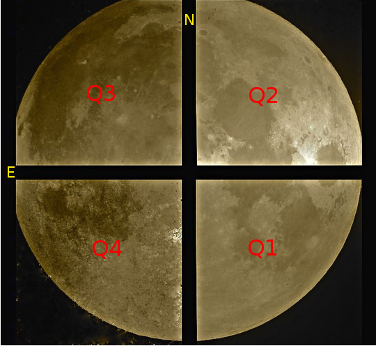

Data formats
============
This section gives a description of the raw data produced by PANIC and how they 
are organized. However, for a deeper description, see the GEIRS_ manual.

Detector
--------
The PANIC instrument had initially was mounted with a mosaic of four 2k x 2k
HAWAII-2RG_ detectors. However, during 2020 was initiated the installation of a new single (monolithic) 4k x 4k HAWAII-4RG_ detector due to the damages in the HAWAII-2RG_.

 * H2RG: The detector is an array (FPA) of four HAWAII-2RG_ detectors. The inter-chip
   gap between the detectors is only 167 pixels (or 75 arcsec at the 2.2m telescope)
   and is filled by dithering with sufficient amplitude. For applications
   which image only 30x30 arcmin this design is ideal.

   HAWAII-2RG_ detectors have an effective surface of 2040x2040 sensitive pixels.
   A 4-pixel wide border is used as reference to correct for relatively slow bias
   drifts.

 * H4RG: The HAWAII-4RG_ detector is a 4096x4096 pixels with 15um pixel pitch; it is
   the next generation, state-of-the-art readout integrated circuit for visible
   and infrared instrumentation in ground-based and space-based telescope applications.

FITS
----

GEIRS_, the software part in charge of the data acquisition and saving, is 
capable of saving the frames in different FITS_ (Flexible Image Transport System) 
formats (integrated, FITS-cubes, MEF, etc ). Next ones are available in the 
Observation Tool (OT_) when an OP (Observing Program) is defined:

 - Integrated All (save -i)
 - FITS Cube (save -1)
 - Single Frame Cube (save -S -1)
   This mode can be seen the raw mode, where all the frames of the ramp
   (including the initial reset frame) are saved into a FITS cube, taking into account also the number of
   repetitions (NEXP); for example, in the cntsr mode, if we have an ITIME=5.8 secs and NEXP=5, we
   will get a FITS cube of 15 frames. As result, this mode will require an important extra disk space to
   store the data.
 - Individual (save)
   Similarly as in the FITS cube mode, but saving all the repetitions in Individual
   files instead of a FITS cube; and therefore, no summation is performed.
 

However, PAPI does not accept any kind of FITS data files available in GEIRS or the OT, only
the configured in the OT, except `Individual`. As result, PAPI accepts 
the next type of FITS files (in order of preference):

 - Integrated All: a unique FITS file with a single extension.
   If the number of coadd (NCOADDS) is > 0, then they will be integrated (arithmetic sum) 
   in a single image. This is the default and more common saving mode used; in fact, it
   is the **default** and more wished saving mode.   
   This mode will also be used when the software or hardware sub-windowing is set and 
   the integrated option is selected. Then, there will be an extension for each sub-window.
 
 - Non-integrated FITS Cube: a unique FITS file having a single extension with N planes, 
   where N is the number of coadds (NCOADDS), i.e., a cube of N planes.  
   This mode will be also used when the software or hardware subwindowing is set up and 
   the no-integrated option is selected.
   
   **Note**: Currently when PAPI finds a FITS-cube, it is collapsed adding the planes up 
   arithmetically without any kind of image registration.
 
  
 .. Note:: Currently PAPI is **not working** with non-integrated **individual** files of an 
    exposition. In case you are interested in **raw mode** (Single Frame Cube) and wish to reduce 
    the data with PAPI, you should convert previously the data to correlated mode (CDS) using the routine `convRaw2CDS.py' 
    that is included in the papi\commissioning directory.

|

In the case of the old **4 x H2RG**, beware that the order of the chips in the raw image produced is as described in
next figure:

|

HAWAII-4RG
**********
    * Hawaii-4RG is a monolithic IR detector, therefore neither quadrants nor MEF files do not make sense in that case.

H4RG Header
'''''''''''
The header keywords currently used in a raw **H4RG** PANIC FITS file is as shown bellow:

::

  SIMPLE  =                    T
  BITPIX  =                   32
  NAXIS   =                    2 / 2
  NAXIS1  =                 4096
  NAXIS2  =                 4096
  EXTEND  =                    T / FITS dataset may contain extensions
  COMMENT   FITS (Flexible Image Transport System) format is defined in 'Astronomy
  COMMENT   and Astrophysics', volume 376, page 359; bibcode: 2001A&A...376..359H
  BSCALE  =                   1.
  BZERO   =                   0. / [adu] real = bzero + bscale*value
  BUNIT   = 'adu     '           / [adu]
  MJD-OBS =         59698.561326 / [d] Modified Julian Date of DATE-OBS
  DATE-OBS= '2022-04-29T13:27:09.3989' / [d] UTC end of first frame read
  DATE    = '2022-04-29T13:33:13' / file creation date (YYYY-MM-DDThh:mm:ss UT)
  UT      =         48429.398901 / [s] 13:27:09.3989 UTC at end of first frame rea
  LST     =         16354.189459 / [s] local sidereal time: 04:32:34 (EOread)
  ALT     =            55.413811 / [deg] Altitude of the object above horizon
  AZ      =           111.106918 / [deg] Azimuth (S=0, W=+90) of the object
  PARANG  =            68.593735 / [deg] Parallactic angle
  ORIGIN  = 'Centro Astronomico Hispano Aleman (CAHA)'
  OBSERVER= 'my_observer'
  TELESCOP= 'CA-3.5  '
  FRATIO  = 'F/10    '           / [1]
  OBSGEO-L=                8.724 / [deg] telesc. geodet. longit. 2015A&A..574A..36
  OBSGEO-B=               49.396 / [deg] telesc. geodet. latit. 2015A&A..574A..36R
  OBSGEO-H=                 560. / [m] above sea level 2015A&A..574A..36R
  LAMPSTS = '        '           / calib. lamp
  INSTRUME= 'PANIC   '           / PAnoramic Near Infrared camera for Calar Alto
  CAMERA  = 'HgCdTe IR-Camera (1 H4RGs)'
  PIXSCALE=             0.186667 / [arcsec/pix]
  EGAIN1  =                   4. / [e-/adu] electrons/DN
  ENOISE1 =                  16. / [e-] electrons/read ems=1
  ROVER   = 'MPIA IR-ROelectronic Vers. 3.1' / Version det. electronics
  WPOS    =                    5 / [ct] number of GEIRS wheels
  W1POS   = 'Coldstop22'
  W2POS   = 'Blank   '
  W3POS   = 'Blank   '
  W4POS   = 'Blank   '
  W5POS   = 'Blank   '
  FILTER  = 'NO      '           / filter macro name of filter combinations
  STRT_INT=         48429.398901 / [s] 13:27:09.3989 start integration (UT)
  STOP_INT=         48463.913569 / [s] 13:27:43.9136 stop integration (UT)
  RA      =            13.856732 / [deg] R.A.: 00:55:25.6
  DEC     =               49.296 / [deg] Dec.: +49:17:46
  EQUINOX =                2000. / [a] Julian Epoch
  AIRMASS =             1.214279 / [1] airmass
  HA      =             54.29408 / [deg] H.A. '03:37:10.58'
  T_FOCUS =                   0. / [mm] telescope focus
  CASSPOS =                   0. / [deg] cassegrain position rel. to NSEW
  OBJECT  = 'J005525+491745'     / telescope target
  POINT_NO=                    0 / [ct] pointing counter
  DITH_NO =                    0 / [ct] dither step
  EXPO_NO =                   10 / [ct] exposure/read counter
  FILENAME= 'OPT_FOCUS_DARK_01_0001.fits'
  FILE_ID = 'Panic.2022-04-29T13:27:09.398_0001_001' / instru., time, image, windo
  TPLNAME = '        '           / macro/template name
  NQCHAN  =                   64 / [ct] output channels of each Hawaii chip
  PTIME   =                    2 / pixel-time-base index
  PREAD   =                10000 / [ns] pixel read selection
  PSKIP   =                  150 / [ns] pixel skip selection
  LSKIP   =                  201 / [ns] line skip selection
  READMODE= 'continuous.sampling.read' / read cycle-type
  IDLEMODE= 'wait    '           / idle to read transition
  IDLETYPE= 'ReadWoConv'         / idle cycle-type
  SAVEMODE= 'continuous.sampling.read' / save cycle-type
  NEXP    =                    6 / cycle repeat count
  CPAR1   =                    2 / cycle type parameter
  ITIME   =             2.765469 / [s] scheduled integration time
  CTIME   =             5.530939 / [s] read-mode cycle time
  EMSAMP  =                    1 / [ct] electronic multi-sampling
  NCOADDS =                    6 / [ct] coadds (total)
  EXPTIME =            16.592816 / [s] total integ. time
  FRAMENUM=                    1 / sum of 6 image(s)
  SKYFRAME= 'unknown '
  DETSEC  = '[1:4096,1:4096]'    / [pix] xrange and yrange of window
  DATASEC = '[1:4096,1:4096]'    / [pix] xy-range of science data
  DETSIZE = '[1:4096,1:4096]'    / [px] full size of the 4 detector mosaic
  CHIPSIZX=                 4096 / [pix] single chip pixels in x
  CHIPSIZY=                 4096 / [pix] single chip pixels in y
  HINVDIR =                    0 / left-right directions of horiz. scanner
  VINVDIR =                    0 / top-bottom directions of vert. scanner
  DETROT90=                    2 / [ct] 90 deg SW image cw rotations
  DETXYFLI=                    0 / [1] SW image flip (1=RightLeft, 2=UpDown)
  B_EXT1  =             2.080078 / [V] external bias 2130
  B_DSUB1 =             0.600179 / [V] det. bias voltage DSUB 1034
  B_VREST1=              0.30009 / [V] det. bias voltage VRESET 517
  B_VBIAG1=             2.199707 / [V] det. bias voltage VBIASGATE 3604
  B_VNBIA1=                   0. / [V] det. bias voltage VNBIAS 0
  B_VPBIA1=                   0. / [V] det. bias voltage VPBIAS 0
  B_VNCAS1=                   0. / [V] det. bias voltage VNCASC 0
  B_VPCAS1=                   0. / [V] det. bias voltage VPCASC 0
  B_VBOUB1=                   0. / [V] det. bias voltage VBIASOUTBUF 0
  B_REFSA1=                   0. / [V] det. bias voltage REFSAMPLE 0
  B_REFCB1=                   0. / [V] det. bias voltage REFCOLBUF 0
  TEMP_A  =            79.331001 / [K] Moly frame (-193.82 C)
  TEMP_B  =            79.329002 / [K] Detector (-194 C)
  PRESS1  =              4.0E-05 / [Pa] (4.000e-10 bar) , 'pressure1'
  TEMPMON =                    8 / [ct] # of temp. monitrd 2022-04-29 13:30 loc. t
  TEMPMON1=            99.503998 / [K] (-173.65 C) Cold plate
  TEMPMON2=               108.75 / [K] (-164.40 C) Lens Mount 1
  TEMPMON3=           102.010002 / [K] (-171.14 C) Charcoal
  TEMPMON4=            77.526001 / [K] (-195.62 C) LN2 detector tank
  TEMPMON5=           104.050003 / [K] (-169.10 C) Filter wheel housing
  TEMPMON6=           105.139999 / [K] (-168.01 C) Preamps
  TEMPMON7=            81.721001 / [K] (-191.43 C) LN2 main tank
  TEMPMON8=           103.540001 / [K] (-169.61 C) Radiation shield
  CREATOR = 'GEIRS : trunk-r799M-65 (Apr  7 2022, 14:12:56)'
  PLX_API =                 8.23 / Major and Minor PLX API version
  OS      = 'Linux irws1 5.3.18-150300.59.63-default #1 SMP Tue Apr 5 12:47:31 UT'
  UUID    = 'e931efc4-c7c0-11ec-a4f3-90b11c480ad2' / Universally unique identifier
  COMMENT = 'no comment'
  OBSERVAT= 'CAHA    '           / Calar Alto, Andalucia, Spain, panic.caha.es
  CHIPID  = '19908   '           / detect. HW ID
  OPCYCL  =                   10 / Operation cycle number
  OPDATE  = '2016-02-18T15:55:00' / UT-date of operation cycle start
  MNTCYCL =                   20 / Mounting cycle number
  MNTDATE = '2017-01-18T15:47:00' / UT-date of mounting cycle start
  CUNIT1  = 'deg     '           / WCS units along axis 1
  CUNIT2  = 'deg     '           / WCS units along axis 2
  CTYPE1  = 'RA---TAN'           / WCS axis 1
  CTYPE2  = 'DEC--TAN'           / WCS axis 2
  CRVAL1  =     13.8567324535148 / [deg] RA in center
  CRVAL2  =               49.296 / [deg] DEC in center
  CD1_1   = -5.18518520726098E-05 / [deg/px] WCS matrix diagonal
  CD2_2   = 5.18518520726098E-05 / [deg/px] WCS matrix diagonal
  CD1_2   = -1.0634992634962E-14 / [deg/px] WCS matrix outer diagonal
  CD2_1   = -1.0634992634962E-14 / [deg/px] WCS matrix outer diagonal
  CRPIX1  =                 2049 / [px] RA and DEC center along axis 1
  CRPIX2  =                 2049 / [px] RA and DEC center along axis 2
  EOF00000=         48429.398866 / [s] 13:27:09.3988 UTC past midnight
  EOF00001=         48433.443542 / [s] 13:27:13.4435 +4.04468 UTC past midnight
  EOF00002=         48436.208914 / [s] 13:27:16.2089 +2.76537 UTC past midnight
  EOF00003=         48438.974351 / [s] 13:27:18.9743 +2.76544 UTC past midnight
  EOF00004=         48441.739649 / [s] 13:27:21.7396 +2.7653 UTC past midnight
  EOF00005=         48444.506323 / [s] 13:27:24.5063 +2.76667 UTC past midnight
  EOF00006=         48447.270818 / [s] 13:27:27.2708 +2.76449 UTC past midnight
  EOF00007=         48450.036261 / [s] 13:27:30.0362 +2.76544 UTC past midnight
  EOF00008=         48452.801598 / [s] 13:27:32.8015 +2.76534 UTC past midnight
  EOF00009=         48455.567247 / [s] 13:27:35.5672 +2.76565 UTC past midnight
  EOF00010=         48458.332675 / [s] 13:27:38.3326 +2.76543 UTC past midnight
  EOF00011=         48461.098155 / [s] 13:27:41.0981 +2.76548 UTC past midnight
  EOF00012=         48463.863639 / [s] 13:27:43.8636 +2.76548 UTC past midnight
  OBS_TOOL= 'createDS'           / PANIC Observing Tool Software version
  PROG_ID = '        '           / PANIC Observing Program ID
  OB_ID   = '1       '           / PANIC Observing Block ID
  OB_NAME = 'OB_dummy'           / PANIC Observing Block Name
  OB_PAT  = 'unknown '           / PANIC Observing Block Pattern Type
  PAT_NAME= 'unknown '           / PANIC Observing Sequence Pattern Name
  PAT_EXPN=                    1 / PANIC Observing Exposition Number
  PAT_NEXP=                    7 / PANIC Observing Number of Expositions
  IMAGETYP= 'DARK    '           / PANIC Image type
  END

HAWAII-2RG
**********

Next table shows the mapping of extension/quadrant names and detectors with
the H2RG detector array:

+------------------------+------+------+------+-------+
| Extension Name         | Q1   |  Q2  |  Q3  |  Q4   |
+========================+======+======+======+=======+
| Detector Hw ID         | SG1  | SG2  | SG3  |  SG4  |
+------------------------+------+------+------+-------+

Note that the order of the extensions in the FITS file is Q1 (ext. 1), 
Q2 (ext. 2), Q3 (ext. 3) and Q4 (ext. 4).

.. Note:: The above extension name and order are only valid from version GEIRS-r731M-18 onwards.

H2RG Header
''''''''''''

The header keywords currently used in a raw **H2RG** PANIC FITS file is as shown bellow:

**Primary Header**

::
 
    SIMPLE  =                    T                                                  
    BITPIX  =                   32                                                  
    NAXIS   =                    2 / 2                                              
    NAXIS1  =                 4096                                                  
    NAXIS2  =                 4096                                                  
    EXTEND  =                    T / FITS dataset may contain extensions            
    COMMENT   FITS (Flexible Image Transport System) format is defined in 'Astronomy
    COMMENT   and Astrophysics', volume 376, page 359; bibcode: 2001A&A...376..359H 
    BSCALE  =                   1.                                                  
    BZERO   =                   0. / [adu] real = bzero + bscale*value              
    BUNIT   = 'adu     '           / [adu]                                          
    MJD-OBS =          57170.68257 / [d] Modified julian date 'days' of observation 
    DATE-OBS= '2015-05-28T16:22:54.0402' / [d] UT-date of observation end           
    DATE    = '2015-05-28T16:22:54' / file creation date (YYYY-MM-DDThh:mm:ss UT)   
    UT      =         58974.040247 / [s] 16:22:54.0402 UTC at EOread                
    LST     =         30949.087329 / [s] local sidereal time: 08:35:49.087 (EOread) 
    ORIGIN  = 'Centro Astronomico Hispano Aleman (CAHA)'                            
    OBSERVER= 'Mathar  '                                                            
    TELESCOP= 'CA-2.2  '                                                            
    FRATIO  = 'F/08    '           / [1]                                            
    OBSGEO-L=            -2.546135 / [deg] telescope geograph. longit. 2015A&A..574A
    OBSGEO-B=            37.223037 / [deg] telescope geograph. latit. 2015A&A..574A.
    OBSGEO-H=                2168. / [m] above sea level 2015A&A..574A..36R         
    LAMPSTS = '        '           / calib. lamp                                    
    INSTRUME= 'PANIC   '           / PAnoramic Near Infrared camera for Calar Alto  
    CAMERA  = 'HgCdTe (4096x4096) IR-Camera (4 H2RGs)'                              
    PIXSCALE=                 0.45 / [arcsec/px]                                    
    EGAIN1  =                 4.84 / [ct] electrons/DN                              
    EGAIN2  =                 4.99 / [ct] electrons/DN                              
    EGAIN3  =                 5.02 / [ct] electrons/DN                              
    EGAIN4  =                 5.45 / [ct] electrons/DN                              
    ENOISE1 =                  16. / [ct] electrons/read ems=1                      
    ENOISE2 =                 16.6 / [ct] electrons/read ems=1                      
    ENOISE3 =                 18.5 / [ct] electrons/read ems=1                      
    ENOISE4 =                 17.9 / [ct] electrons/read ems=1                      
    ROVER   = 'MPIA IR-ROelectronic Vers. 3' / Version det. electronics             
    WPOS    =                    5 / [ct] number of GEIRS wheels                    
    W1POS   = 'Coldstop22'                                                          
    W2POS   = 'H       '                                                            
    W3POS   = 'Ks      '                                                            
    W4POS   = 'dummy   '                                                            
    W5POS   = 'Black   '                                                            
    FILTER  = 'NO      '           / filter macro name of filter combinations       
    STRT_INT=         58943.164225 / [s] 16:22:23.1642 start integration (UT)       
    STOP_INT=         58946.502476 / [s] 16:22:26.5025 stop integration (UT)        
    RA      =             172.8182 / [deg] R.A.: 11:31:16.4                         
    DEC     =            33.088802 / [deg] Dec.: +33:05:20                          
    EQUINOX =                2000. / [a] Julian Epoch                               
    OBSEPOCH=          2015.403645 / [a] Julian Epoch                               
    AIRMASS =             1.232127 / [1] airmass                                    
    HA      =           316.144687 / [deg] H.A. '21:04:34.72'                       
    T_FOCUS =                   0. / [mm] telescope focus                           
    CASSPOS =                   0. / [deg] cassegrain position rel. to NSEW         
    OBJECT  = 'unknown '           / telescope target                               
    POINT_NO=                    0 / [ct] pointing counter 
    DITH_NO =                    0 / [ct] dither step                               
    EXPO_NO =                    2 / [ct] exposure/read counter                     
    FILENAME= 'test_0001.fits'                                                      
    FILE_ID = 'Panic.2015-05-28T16:22:23.164_0001_001' / instru., time, image, windo
    TPLNAME = '        '           / macro/template name                            
    TIMER0  =                 2740 / [ms]                                           
    TIMER1  =                 2740 / [ms]                                           
    TIMER2  =                    0 / [us]                                           
    PTIME   =                    2 / pixel-time-base index                          
    PREAD   =                10000 / [ns] pixel read selection                      
    PSKIP   =                  150 / [ns] pixel skip selection                      
    LSKIP   =                  150 / [ns] line skip selection                       
    READMODE= 'line.interlaced.read' / read cycle-type                              
    IDLEMODE= 'wait    '           / idle to read transition                        
    IDLETYPE= 'ReadWoConv'         / idle cycle-type                                
    SAVEMODE= 'line.interlaced.read' / save cycle-type                              
    NEXP    =                    1 / cycle repeat count                             
    CPAR1   =                    1 / cycle type parameter                           
    ITIME   =             2.739931 / [s] (on chip) integration time                 
    CTIME   =             5.481201 / [s] read-mode cycle time                       
    HCOADDS =                    1 / [ct] # of hardware coadds                      
    EMSAMP  =                    1 / [ct] electronic multi-sampling                 
    PCOADDS =                    1 / [ct] # of coadded plateaus/periods             
    SCOADDS =                    1 / [ct] # of software coadds                      
    SWMSAMP =                    1 / [ct] # software multisampling                  
    NCOADDS =                    1 / [ct] effective coadds (total)                  
    EXPTIME =             2.739931 / [s] total integ. time                          
    FRAMENUM=                    1 / of 1 saved                                     
    SKYFRAME= 'unknown '                                                            
    DETSEC  = '[1:4096,1:4096]'    / [px] xrange and yrange of window               
    DATASEC = '        '           / [px] xy-range of science data                  
    DETSIZE = '[1:4096,1:4096]'    / [px] full size of the 4 detector mosaic        
    CHIPSIZX=                 2048 / [px] single chip pixels in x                   
    CHIPSIZY=                 2048 / [px] single chip pixels in y                   
    DETROT90=                    0 / [ct] 90 deg SW image cw rotations              
    DETXYFLI=                    0 / [1] SW image flip (1=RightLeft, 2=UpDown)      
    B_EXT1  =             2.679688 / [V] external bias 2744                         
    B_EXT2  =             2.679688 / [V] external bias 2744                         
    B_EXT3  =             2.679688 / [V] external bias 2744                         
    B_EXT4  =             2.679688 / [V] external bias 2744                         
    B_DSUB1 =             1.569727 / [V] det. bias voltage DSUB 3420                
    B_DSUB2 =             1.569727 / [V] det. bias voltage DSUB 3420                
    B_DSUB3 =             1.569727 / [V] det. bias voltage DSUB 3420                
    B_DSUB4 =             1.569727 / [V] det. bias voltage DSUB 3420                
    B_VREST1=              1.07999 / [V] det. bias voltage VRESET 2353              
    B_VREST2=              1.07999 / [V] det. bias voltage VRESET 2353              
    B_VREST3=              1.07999 / [V] det. bias voltage VRESET 2353              
    B_VREST4=              1.07999 / [V] det. bias voltage VRESET 2353              
    B_VBIAG1=             2.199707 / [V] det. bias voltage VBIASGATE 3604           
    B_VBIAG2=             2.199707 / [V] det. bias voltage VBIASGATE 3604           
    B_VBIAG3=             2.199707 / [V] det. bias voltage VBIASGATE 3604           
    B_VBIAG4=             2.199707 / [V] det. bias voltage VBIASGATE 3604           
    B_VNBIA1=                   0. / [V] det. bias voltage VNBIAS 0                 
    B_VNBIA2=                   0. / [V] det. bias voltage VNBIAS 0                 
    B_VNBIA3=                   0. / [V] det. bias voltage VNBIAS 0
    B_VNBIA4=                   0. / [V] det. bias voltage VNBIAS 0                 
    B_VPBIA1=                   0. / [V] det. bias voltage VPBIAS 0                 
    B_VPBIA2=                   0. / [V] det. bias voltage VPBIAS 0                 
    B_VPBIA3=                   0. / [V] det. bias voltage VPBIAS 0                 
    B_VPBIA4=                   0. / [V] det. bias voltage VPBIAS 0                 
    B_VNCAS1=                   0. / [V] det. bias voltage VNCASC 0                 
    B_VNCAS2=                   0. / [V] det. bias voltage VNCASC 0                 
    B_VNCAS3=                   0. / [V] det. bias voltage VNCASC 0                 
    B_VNCAS4=                   0. / [V] det. bias voltage VNCASC 0                 
    B_VPCAS1=                   0. / [V] det. bias voltage VPCASC 0                 
    B_VPCAS2=                   0. / [V] det. bias voltage VPCASC 0                 
    B_VPCAS3=                   0. / [V] det. bias voltage VPCASC 0                 
    B_VPCAS4=                   0. / [V] det. bias voltage VPCASC 0                 
    B_VBOUB1=                   0. / [V] det. bias voltage VBIASOUTBUF 0            
    B_VBOUB2=                   0. / [V] det. bias voltage VBIASOUTBUF 0            
    B_VBOUB3=                   0. / [V] det. bias voltage VBIASOUTBUF 0            
    B_VBOUB4=                   0. / [V] det. bias voltage VBIASOUTBUF 0            
    B_REFSA1=                   0. / [V] det. bias voltage REFSAMPLE 0              
    B_REFSA2=                   0. / [V] det. bias voltage REFSAMPLE 0              
    B_REFSA3=                   0. / [V] det. bias voltage REFSAMPLE 0              
    B_REFSA4=                   0. / [V] det. bias voltage REFSAMPLE 0              
    B_REFCB1=                   0. / [V] det. bias voltage REFCOLBUF 0              
    B_REFCB2=                   0. / [V] det. bias voltage REFCOLBUF 0              
    B_REFCB3=                   0. / [V] det. bias voltage REFCOLBUF 0              
    B_REFCB4=                   0. / [V] det. bias voltage REFCOLBUF 0              
    TEMP_A  =            79.068001 / [K] Moly frame (-194.08 C)                     
    TEMP_B  =            79.999001 / [K] Detector (-193 C)                          
    PRESS1  =              1.0E-05 / [Pa] (1.020e-10 bar) , 'pressure1'             
    TEMPMON =                    8 / [ct] # of temp. monitrd 2015-05-28 16:21 loc. t
    TEMPMON1=            84.508003 / [K] (-188.64 C) Cold plate                     
    TEMPMON2=               97.056 / [K] (-176.09 C) Lens Mount 1                   
    TEMPMON3=            85.961998 / [K] (-187.19 C) Charcoal                       
    TEMPMON4=            75.846001 / [K] (-197.30 C) LN2 detector tank              
    TEMPMON5=            87.633003 / [K] (-185.52 C) Filter wheel housing           
    TEMPMON6=            94.026001 / [K] (-179.12 C) Preamps                        
    TEMPMON7=            79.591003 / [K] (-193.56 C) LN2 main tank                  
    TEMPMON8=               89.347 / [K] (-183.80 C) Radiation shield               
    CREATOR = 'GEIRS : trunk-r737M-13 (May 28 2015, 16:17:00), Panic'               
    COMMENT = 'no comment'                                                          
    OBSERVAT= 'CAHA    '           / Calar Alto, Almeria, Andalucia, Spain, panic.ca
    OPCYCL  =                    9 / Operation cycle number                         
    OPDATE  = '2015-04-28T15:16:00' / UT-date of operation cycle start              
    MNTCYCL =                    7 / Mounting cycle number                          
    MNTDATE = '2015-01-29T15:00:00' / UT-date of mounting cycle start               
    HIERARCH CAHA AMBI WINSP = 4.5 / [m/s] wind speed day=20150528 UT=1448          
    HIERARCH CAHA AMBI WINDIR = 149. / [deg] wind direction day=20150528 UT=1448    
    HIERARCH CAHA AMBI TEMP = 15.2 / [C] temperature day=20150528 UT=1448           
    HIERARCH CAHA AMBI HUMI =   46 / [%] rel. humidity day=20150528 UT=1448         
    HIERARCH CAHA AMBI DEWP =  3.7 / [C] dew point day=20150528 UT=1448             
    HIERARCH CAHA AMBI PRESS = 778. / [hPa] air pressure day=20150528 UT=1448       
    HIERARCH CAHA AMBI CLOUD = -25.7 / [] cloud sensor day=20150528 UT=1448         
    COMMENT Linux panic22 3.11.6-4-desktop #1 SMP PREEMPT Wed Oct 30 18:04:56 UTC 20
    COMMENT 13 (e6d4a27) x86_64                                                     
    COMMENT Plx API Version 7.10                                                    
    EOFRM000=         58943.164227 / [s] 16:22:23.1642 UTC past midnight
    EOFRM002=         58944.177113 / [s] 16:22:24.1771 +1.01289 UTC past midnight   
    END

**Extensions Header (SG1)**

::

    XTENSION= 'IMAGE   '           / IMAGE extension                                
    BITPIX  =                   32 / number of bits per data pixel                  
    NAXIS   =                    2 / number of data axes                            
    NAXIS1  =                 2048 / length of data axis 1                          
    NAXIS2  =                 2048 / length of data axis 2                          
    PCOUNT  =                    0 / required keyword; must = 0                     
    GCOUNT  =                    1 / required keyword; must = 1                     
    EXTNAME = 'Q1      '                                                            
    HDUVERS =                    1                                                  
    DETSEC  = '[2049:4096,1:2048]' / [px] section of DETSIZE                        
    DATASEC = '[5:2044,5:2044]'    / [px] section of CHIPSIZ                        
    PERCT025=                2688. / 2.5 % percentile ADU                           
    PERCT050=                2700. /   5 % percentile ADU                           
    PERCT075=                2705. / 7.5 % percentile ADU                           
    PERCT100=                2708. /  10 % percentile ADU                           
    PERCT125=                2712. / 12.5 % percentile ADU                          
    PERCT150=                2714. /  15 % percentile ADU                           
    PERCT175=                2716. / 17.5 % percentile ADU                          
    PERCT200=                2718. /  20 % percentile ADU                           
    PERCT225=                2720. / 22.5 % percentile ADU                          
    PERCT250=                2723. /  25 % percentile ADU                           
    PERCT275=                2725. / 27.5 % percentile ADU                          
    PERCT300=                2726. /  30 % percentile ADU                           
    PERCT325=                2728. / 32.5 % percentile ADU                          
    PERCT350=                2730. /  35 % percentile ADU                           
    PERCT375=                2732. / 37.5 % percentile ADU                          
    PERCT400=                2733. /  40 % percentile ADU                           
    PERCT425=                2735. / 42.5 % percentile ADU                          
    PERCT450=                2736. /  45 % percentile ADU                           
    PERCT475=                2738. / 47.5 % percentile ADU                          
    PERCT500=                2739. /  50 % percentile ADU                           
    PERCT525=                2741. / 52.5 % percentile ADU                          
    PERCT550=                2743. /  55 % percentile ADU                           
    PERCT575=                2745. / 57.5 % percentile ADU                          
    PERCT600=                2746. /  60 % percentile ADU                           
    PERCT625=                2748. / 62.5 % percentile ADU                          
    PERCT650=                2749. /  65 % percentile ADU                           
    PERCT675=                2750. / 67.5 % percentile ADU                          
    PERCT700=                2753. /  70 % percentile ADU                           
    PERCT725=                2754. / 72.5 % percentile ADU                          
    PERCT750=                2756. /  75 % percentile ADU                           
    PERCT775=                2758. / 77.5 % percentile ADU                          
    PERCT800=                2760. /  80 % percentile ADU                           
    PERCT825=                2763. / 82.5 % percentile ADU                          
    PERCT850=                2765. /  85 % percentile ADU                           
    PERCT875=                2768. / 87.5 % percentile ADU                          
    PERCT900=                2772. /  90 % percentile ADU                           
    PERCT925=                2776. / 92.5 % percentile ADU                          
    PERCT950=                2780. /  95 % percentile ADU                           
    PERCT975=                2787. / 97.5 % percentile ADU
    RA      =           332.367528 / [deg] R.A.: 22:09:28.2                         
    DEC     =            51.084307 / [deg] Dec.: +51:05:04                          
    PIXSCALE=                 0.45 / [arcsec/px]                                    
    CUNIT1  = 'deg     '           / WCS units along axis 1                         
    CUNIT2  = 'deg     '           / WCS units along axis 2                         
    CTYPE1  = 'RA---TAN'           / WCS axis 1                                     
    CTYPE2  = 'DEC--TAN'           / WCS axis 2                                     
    CRVAL1  =      332.36752753434 / [deg] RA in mosaic center                      
    CRVAL2  =     51.0843069975685 / [deg] DEC in mosaic center                     
    CD1_1   = -0.000124999996688631 / [deg/px] WCS matrix diagonal                  
    CD2_2   = 0.000124999996688631 / [deg/px] WCS matrix diagonal                   
    CD1_2   = -2.56379278852432E-14 / [deg/px] WCS matrix outer diagonal            
    CD2_1   = -2.56379278852432E-14 / [deg/px] WCS matrix outer diagonal            
    CRPIX1  =                  -81 / [px] RA and DEC center along axis 1            
    CRPIX2  =                 2132 / [px] RA and DEC center along axis 2            
    DET_ID  = 'SG1     '           / lower right (SW) chip                          
    COMMENT WCS assumes CHIPGAPX=167, CHIPGAPY=167, north=90 deg                    
    BSCALE  =                   1.                                                  
    BZERO   =                   0.                                                  
    END                      

.. _otkeywords:

Observation Tool keywords
-------------------------
Next keywords are automatically added to the FITS header by the PANIC Observation Tool (OT_),
as each file is created. If these are not saved, neither PAPI nor PQL will work correctly::

    OBS_TOOL= 'OT_V1.1 '           / PANIC Observing Tool Software version          
    PROG_ID = '        '           / PANIC Observing Program ID                     
    OB_ID   = '6       '           / PANIC Observing Block ID                       
    OB_NAME = 'OB CU Cnc Ks 2'     / PANIC Observing Block Name                     
    OB_PAT  = '5-point '           / PANIC Observing Block Pattern Type             
    PAT_NAME= 'OS Ks 2 '           / PANIC Observing Secuence Pattern Name          
    PAT_EXPN=                    1 / PANIC Pattern exposition number                
    PAT_NEXP=                    5 / PANIC Pattern total number of expositions      
    IMAGETYP= 'SCIENCE '           / PANIC Image type

Data
----
Raw images pixels are coded with 32-bit signed integers (BITPIX=32), however
final reduced images are coded with 32-bit single precision floating point (BITPIX=-32).
The layout of each chip image in a raw image is described above. 

Classification
--------------

Any raw frame can be classified on the basis of a set of keywords read from its header. 
Data classification is typically carried out by the Pipeline at start or by PQL, 
that apply the same set of classification rules. The association of a raw frame 
with calibration data (e.g., of a science frame with a master dark frame) can be
obtained by matching the values of a different set of header keywords 
(filter, texp, ncoadds, itime, readmode, date-obs, etc).
Each kind of raw frame is typically associated to a single PAPI pipeline recipe, 
i.e., the recipe assigned to the reduction of that specific frame type. In the 
pipeline environment this recipe would be launched automatically.
In the following, all PANIC raw data frames are listed, together with the 
keywords used for their classification and correct association. 

.. tabularcolumns:: |r|J|

=======================     ===========
Type                        Description
=======================     ===========
``DARK``                    Dark frame 
``DOME_FLAT``               Dome flat-field frame (lamp on/lamp off)
``SKY_FLAT``                Sky flat-field frame
``FOCUS``                   Focus frame of a focus series
``SCIENCE``                 Science frame
``SKY``                     Sky frame (mostly clear) used for extended object reduction
=======================     ===========

Data grouping
-------------

Once the raw files are classified, they are grouped into observing sequences, taking
into account the :ref:`keywords <otkeywords>` added by the Observation Tool (OT_), and
finding out the dither sequences observed.
This way, all files beloging to the same observing sequence will be processed 
together.

.. _astromatic: http://www.astromatic.net/
.. _sextractor: http://www.astromatic.net/software/sextractor
.. _scamp: http://www.astromatic.net/software/scamp
.. _swarp: http://www.astromatic.net/software/swarp
.. _HAWAII-2RG: http://panic.iaa.es/detectors
.. _HAWAII-4RG: http://www.teledyne-si.com/products-and-services/imaging-sensors/hawaii-4rg
.. _GEIRS: http://www2.mpia-hd.mpg.de/~mathar/public/PANIC-SW-DCS-01.pdf
.. _OT: http://www.iaa.es/~agsegura/PANIC_OT/PANIC_Observation_Tool.html
.. _FITS: http://fits.gsfc.nasa.gov
